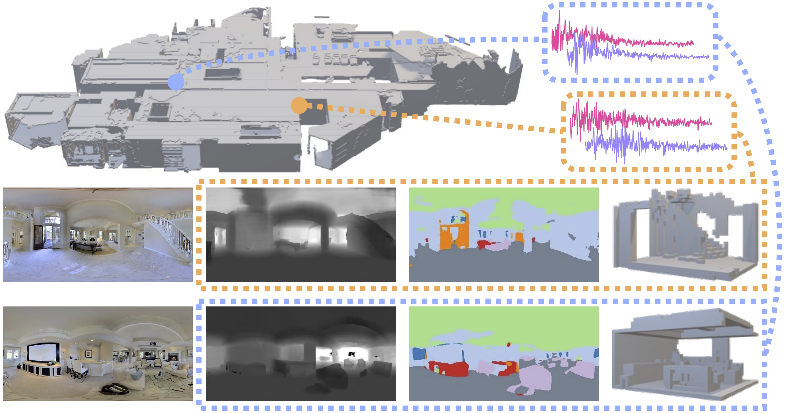
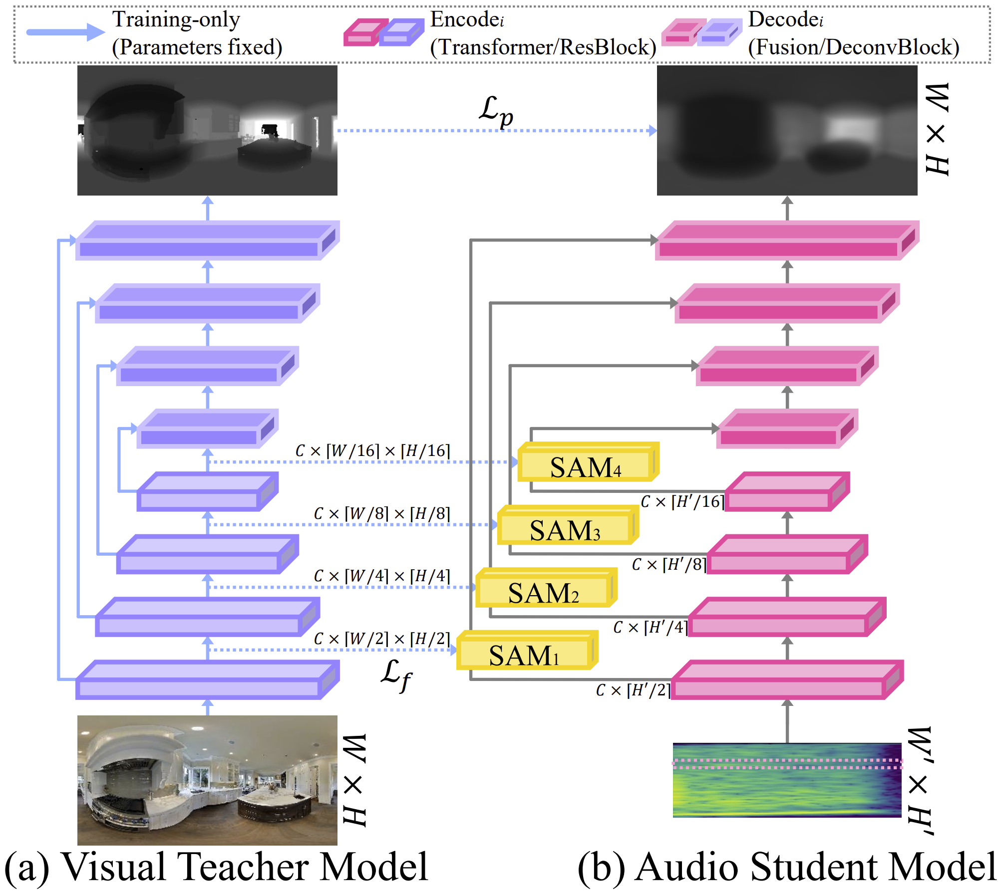

# DAPS

Official repository of Dense 2D-3D Indoor Prediction with Sound via Aligned Cross-Modal Distillation (ICCV 2023)


### [[Project Page]](https://hs-yn.github.io/DAPS)

## DAPS (Dense Auditory Prediction of Surroundings) benchmark



We curated the DAPS benchmark based on [Matterport3D](https://niessner.github.io/Matterport/) and [SoundSpaces](https://soundspaces.org/). Tools and detailed instructions for preparing the data is available [here](https://github.com/HS-YN/DAPS/tree/main/DAPS).


## SAM (Spatial Alignment via Matching) distillation framework



The code for our model and evaluation will be released shortly.


## Citation

If you find our work useful in your research, please consider citing:

```bibtex
@InProceedings{
    author    = {Yun, Heeseung and Na, Joonil and Kim, Gunhee},
    title     = {Dense 2D-3D Indoor Prediction with Sound via Aligned Cross-Modal Distillation},
    booktitle = {ICCV},
    year      = {2023}
}
```
